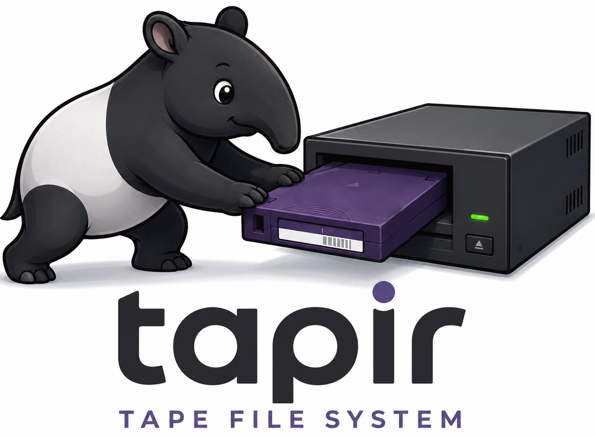

# tapir (TApe Physical-Index aRchive)

A FUSE filesystem and tools for easily browsing/appending to a **tar tape archive**:
a data tar at tape file N + a cumulative `manifest.json` index tar after it.
Metadata (`ls`, `stat`) is served from the in-RAM index; content is read back
through libarchive on demand and cached.

This project is inspired by the LTFS project, which is a self-describing indexed
filesystem on partitioned tapes. Unlike LTFS, tapir simplifies file handling into
tar operations on tape with separate index files, and works on non-partitioned
tapes (including LTO WORM).

Built around a shared static library, **libtapir** (cf. LTFS's `libltfs`):

- **`tapir`** — read/append/delete FUSE3 mount of the tape. Appends stream a new
  file (write-once, sealed on close); deletes are index-only; a new index is
  written to tape at unmount, only if anything changed.
- **`tfsck`** — offline verifier: streams each data tape file (at its recorded
  block factor), recomputes SHA-256 and checks it against the index
  (deleted-but-retained members are reported as *orphans*, not failures).
- **`mktapir`** — build/convert the index.
  - `import` scans existing tar tape files (no `-f` = the whole tape; or `-f` with a
    comma-list of tape files) and adds their members to the index, auto-detecting
    each file's block factor — converts a pre-existing (non-tapir) tape in one go.
  - `append` re-streams a tar from disk into a new tape file at EOD and indexes it.

  Each archive's block factor is stored per-archive in the manifest, so tapes
  mixing block sizes convert correctly.

**Status:** tape-only (operates on the no-rewind device, e.g. `…-nst`). Reads
currently stream a whole data tape file to find a member; per-file `mt seek`
coordinates are the next step for faster random access.

## Requirements (enforced by `configure`)

- A C++ compiler with working **C++20** support (hard minimum).
- **C++23** is preferred and selected automatically when available, enabling
  **`std::expected`** and **`std::print`**. Control with `--enable-cxx23={auto,yes,no}`.
- A usable **libarchive >= 3.0.0** with PAX support.
- **libfuse 3** (>= 3.0) — required by `tapir` (no fuse2 fallback).
- **nlohmann/json** (>= 3.0) — parses the manifest index.
- **libcrypto** (OpenSSL) — SHA-256 of appended files and `tfsck`.

### Installing the dependencies to build this project (Debian/Ubuntu)

```sh
sudo apt-get install build-essential libarchive-dev libfuse3-dev fuse3 nlohmann-json3-dev libssl-dev
```

Tape positioning uses the Linux `st` driver ioctls (`<sys/mtio.h>`) directly, so
no `mt` binary is required at runtime.

- `libfuse3-dev` provides the fuse3 headers and the `fuse3.pc` that pkg-config
  needs; `fuse3` provides the `fusermount3` mount helper used at runtime. On recent Debian builds
  the libfuse3 *runtime* libs are already present and only `libfuse3-dev` is
  missing.

## Build

```sh
./autogen.sh           # bootstrap: regenerates ./configure (after checkout / editing configure.ac)
./configure            # checks C++20/23 + libarchive + libfuse3 + nlohmann/json + libcrypto
make
```

## Usage

```sh
# mount (use the no-rewind by-id device); -b N is the manifest tar block factor (×512, default 512)
./src/tapir /dev/tape/by-id/scsi-XXXX-nst <mountpoint> [-b N] [fuse options]
fusermount3 -u <mountpoint>      # unmount → writes a fresh index to tape if anything changed

# verify a tape against its manifest
./src/tfsck /dev/tape/by-id/scsi-XXXX-nst [-b N]

# convert an existing (non-tapir) tape: index its tar archive(s) and write a manifest at EOD.
# no -f scans the whole tape (block size auto-detected); -f takes a comma-list of tape files.
# requires free space at the end of the tape for the small index file.
./src/mktapir import /dev/tape/by-id/scsi-XXXX-nst [-f 0,2,5] [-b <block-factor-override>]

# append a tar from disk into a new tape file and add to index
./src/mktapir append /dev/tape/by-id/scsi-XXXX-nst /path/to/file.tar -b <block-factor>
```

`tapir` reads the latest manifest from the end of the tape, serves the tree, and
streams data tape files on demand to read members. Newly added files are committed as a new
tape file at unmount; deletes are index-only (the data on tape is never rewritten).

`./configure` accepts the usual overrides, e.g. `./configure CXX=clang++`,
`./configure --enable-cxx23=no` (force the C++20 baseline), or
`PKG_CONFIG_PATH=/opt/lib/pkgconfig ./configure` for a library in a non-standard prefix.

## How the gnu autotools checks work

- **C++ standard** — C++20 is the hard minimum (`m4/ax_cxx_compile_stdcxx_20.m4`,
  vendored so autoconf-archive is *not* required: it probes concepts, `consteval`,
  templated lambdas, `std::span`). C++23 is preferred and tried first via
  `m4/ax_cxx_try_stdcxx_23.m4` (probes `__cpp_if_consteval`); the first working
  `-std` switch is appended to `$CXX`. `--enable-cxx23=no` skips straight to C++20;
  `=yes` makes C++23 (and the two features below) mandatory. On Debian Trixie C++23 is
  selected automatically (`-std=c++23`) and the compiler default is C++17
  when using gcc provided by the current `build-essential` package (gcc 14+).
- **std::expected / std::print** — only probed in C++23 mode, via real link tests
  (`#include <expected>` / `#include <print>`). Each defines `HAVE_STD_EXPECTED` /
  `HAVE_STD_PRINT` so the code can `#ifdef` to use them with a fallback. Both are
  available with g++ 14 on this box.
- **libarchive** — pkg-config (`libarchive >= 3.0.0`) with a header/library fallback,
  followed by a functional gate that *links* against the writer API used by the project
  and enforces `ARCHIVE_VERSION_NUMBER >= 3000000` at compile time. The functional gate
  is the real backstop: it rejects an old or broken libarchive even if the headers are
  present.
- **libfuse 3** — pkg-config `fuse3 >= 3.0`, required (errors out otherwise). Defines
  `HAVE_FUSE3` and `FUSE_USE_VERSION 31` in `config.h`, which the sources include
  *before* `<fuse.h>`.

Only pkg-config is assumed available at bootstrap time; the C++ std macros are self-contained in the m4/ folder.
